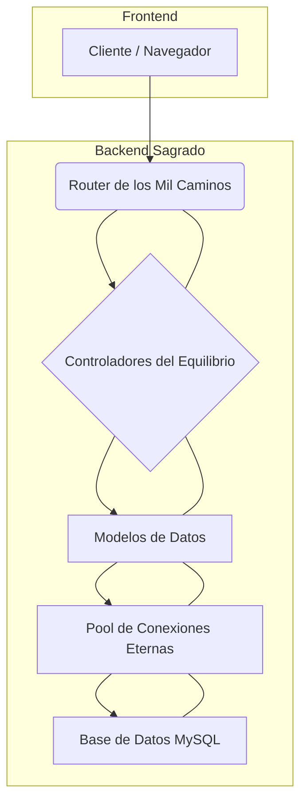

## Evaluación – Proyecto NULLCATIA: Un Viaje a la Modernización Felina
Nombres: Vicente Lizana, Jhon Bustos, Raul Ibarra, Jorge Moncada

### Introducción

En el vasto y enigmático reino digital de **NULLCATIA**, una singular sociedad de miles de "gatitos nulos" busca su propósito. Estos seres, nacidos sin valores predeterminados, requieren ser inicializados para descubrir su esencia y función en este mundo virtual. La estructura social de NULLCATIA se organiza en **Clanes**, cada uno dedicado a custodiar un tipo específico de **Territorio**. Estos territorios son variados y evocadores, abarcando desde **bosques binarios** y **ríos de paquetes** hasta **montañas de índices**, **praderas de pila**, **archipiélago de APIs**, **cuevas de caché**, **océanos de objetos**, **llanuras de logs** y **valles de versiones**. La transmisión del conocimiento ancestral y la búsqueda de sentido se realizan a través de **Pergaminos**, donde se registran consultas milenarias que guían la existencia felina.

Con la inminente **Transformación Felina 4.0**, el venerable Consejo de NULLCATIA ha tomado una decisión crucial: modernizar su infraestructura. Para ello, se ha encomendado la creación del **Backend Sagrado**, un conjunto de microservicios desarrollados con **Express.js** que expondrán una **API RESTful** robusta, respaldada por una **base de datos MySQL** consolidada y eficiente. Este backend se articula a través de tres artefactos legendarios:

* **El Pool de Conexiones Eternas:** Concebido como un cántaro encantado, este componente esencial gestiona las corrientes de bits, asegurando que las innumerables solicitudes de los gatitos no saturen el nodo central del reino, manteniendo así la fluidez de las operaciones.
* **Los Controladores del Equilibrio:** Estos monjes, guardianes de la lógica y la integridad, se encargan de validar meticulosamente cada petición entrante. Con la fuerza del `async/await`, repelen cualquier intento de dependencias circulares, asegurando un flujo de datos lineal y predecible.
* **El Enrutador de los Mil Caminos:** Un laberinto cuidadosamente ordenado en capas, donde cada **endpoint RESTful** actúa como una revelación, desvelando un fragmento crucial de la vasta memoria gatuna y guiando las peticiones a su destino.

El desafío más formidable se alza en el corazón del reino: **El Laberinto de Enrutamiento**. Este entramado infinito de caminos REST amenaza con desviar y perder cada petición en bucles sin fin. Solo un mapa claro de rutas y una estructura de capas bien definida podrán dominarlo.

**Felix Socketpaw**, **Serafina Cachewhisker**, y **Captain Middleware** son los héroes del backend que deberán diseñar rutas declarativas, controladores desacoplados y un sistema central de manejo de errores para superar el Laberinto de Enrutamiento y asegurar que cada petición llegue sana y salva a su destino.

Así, tu misión—como novicio del Consejo—es implementar los ritos backend que mantengan a raya al enemigo: diseñar **modelos normalizados**, silenciar excepciones con **manejo de errores `try/catch`**, y levantar **baluartes de autenticación `middleware`**. Solo entonces el Reino de NULLCATIA conservará sus vidas.

### Arte de las Interfaces (Frontend)

El Backend Sagrado solo brilla cuando es reflejado por una capa de presentación pulcra y accesible. Para ello, el Consejo invoca a dos héroes adicionales que gobiernan el reino visual: **Sparkle Templatetail**, la arquitecta de vistas, y **Luna Styleshade**, la maestra de estilos.

Estos héroes del frontend, junto con **Pixel Purrfect** (Diseñador UI) y **Ajax Whisperpaw** (Mensajero Asíncrono), tienen una misión conjunta para el frontend:

* **Estructurar la carpeta `/views`** con un sistema de `layouts` y `partials` que derrote la duplicación.
* **Orquestar componentes visuales reutilizables:** tarjetas de gatos, tablas de clanes y formularios de pergaminos.
* **Domar El Laberinto de Enrutamiento desde la perspectiva del cliente**, enlazando cada acción del usuario con la ruta server-side correspondiente sin crear callejones rotos.

Felix, Serafina, Captain Middleware, Sparkle y Luna trabajarán en conjunto: mientras el backend traza los caminos, el frontend los ilumina con vistas coherentes y estilos unificados. Solo así las peticiones viajarán sin extraviarse en el Laberinto.

---

### Desarrollo del Proyecto

#### 1. Diseño y Modelado de la Base de Datos Relacional (MySQL)

La base de datos MySQL es la columna vertebral del Backend Sagrado, almacenando la esencia del reino de NULLCATIA. Su diseño se ha concebido siguiendo estrictos principios de **normalización** para asegurar la **integridad de los datos**, **minimizar la redundancia** y **optimizar el rendimiento** de las consultas. La estructura de tablas definida para este proyecto incluirá: `clan`, `territory`, `cat`, `parchment` y la tabla de unión `cat_parchment`, que gestiona la relación muchos a muchos entre gatitos y pergaminos.

El archivo `database/schema.sql` es el script fundamental que contendrá la definición completa de todas estas tablas. Incluirá las **claves primarias auto-incrementales** para la identificación única de cada registro, las **claves foráneas** que establecerán las relaciones lógicas entre las tablas (por ejemplo, un gatito pertenece a un clan, un territorio pertenece a un clan, etc.), y los **índices** necesarios sobre columnas que serán frecuentemente utilizadas en búsquedas y uniones para acelerar las operaciones.

(Espacio para el código SQL completo de `database/schema.sql` para la creación de la base de datos y todas las tablas, incluyendo llaves primarias, foráneas y restricciones como `ON DELETE RESTRICT`, `ON DELETE SET NULL` y `ON UPDATE CASCADE`).

---

##### Captura de Pantalla: Diagrama Entidad-Relación (ERD) de la Base de Datos

[Espacio para una captura de pantalla del diagrama Entidad-Relación (ERD) de la base de datos, mostrando las tablas y sus relaciones.]

---

Este diseño de base de datos no solo organiza la información de manera lógica, sino que también garantiza la **integridad referencial** mediante políticas de eliminación y actualización:

* Las restricciones `ON DELETE RESTRICT` en las tablas `territory` y `cat` aseguran que no se pueda eliminar un Clan si aún tiene territorios o gatitos asociados, salvaguardando así la "integridad gatuna" del reino.
* Para la tabla `parchment`, se utilizará `ON DELETE SET NULL` en la clave foránea `clan_id`. Esto significa que si un clan es eliminado, los pergaminos que estaban asociados a él no se borrarán, sino que simplemente dejarán de estar vinculados a un clan específico, permitiendo que "floten libremente" en el reino.
* En la tabla de unión `cat_parchment`, se implementará `ON DELETE CASCADE` para las claves foráneas `cat_id` y `parchment_id`. Esto asegura que si un gatito o un pergamino son eliminados, todos los registros de consulta asociados en `cat_parchment` también se eliminarán automáticamente, manteniendo la coherencia de los datos históricos.

---

#### 2. Arquitectura de Capas y Acceso a Datos

La aplicación está diseñada bajo una clara **arquitectura de capas**, promoviendo la **separación de responsabilidades**. Esta estructura modular facilita el desarrollo, mantenimiento, escalabilidad y la depuración del sistema, al tiempo que garantiza que cada componente tenga un propósito bien definido.

##### Diagrama de Componentes Sugerido



**Estructura de Carpetas Clave:**

* **`config/`**: Esta carpeta centralizará todos los archivos de configuración de la aplicación. Aquí se gestionarán parámetros cruciales como las credenciales de conexión a la base de datos, puertos de escucha del servidor y otras variables de entorno esenciales para el funcionamiento del sistema.

    ---

    ##### Captura de Pantalla: Contenido de la carpeta `config/`

    [Espacio para una captura de pantalla del explorador de archivos mostrando los archivos dentro de la carpeta `config/`.]

    ---

* **`models/`**: Esta carpeta contiene los **Modelos de Datos**, que representan las tablas de la base de datos. Cada archivo en esta carpeta ( `catModel.js`, `clanModel.js`, `scrollModel.js`, y `territoryModel.js`) define la estructura y la lógica para interactuar con una tabla específica. Estos modelos encapsulan las operaciones CRUD (Crear, Leer, Actualizar, Eliminar) y proporcionan una interfaz consistente para acceder y manipular los datos.

    ---

    ##### Captura de Pantalla: Estructura de la carpeta `models/`

    [Espacio para una captura de pantalla del explorador de archivos mostrando los modelos definidos dentro de la carpeta `models/`.]

    ---

* **`controllers/`**: Aquí reside la **lógica de negocio** principal de la aplicación. Los **Controladores** ( `catController.js`, `clanController.js`, `scrollController.js`, y `territoryController.js`) reciben las peticiones del enrutador, interactúan con los modelos para obtener o modificar datos, y aplican las reglas de validación necesarias. También gestionan las excepciones que puedan surgir de las operaciones con la base de datos, utilizando bloques `try/catch` para una gestión robusta de errores. Finalmente, preparan la respuesta adecuada para ser enviada al cliente, ya sea en formato JSON para la API o mediante el renderizado de **vistas EJS** para la interfaz de usuario.

    ---

    ##### Captura de Pantalla: Estructura de la carpeta `controllers/`

    [Espacio para una captura de pantalla del explorador de archivos mostrando los controladores definidos dentro de la carpeta `controllers/`.]

    ---

* **`routes/`**: Esta carpeta es el corazón del **Enrutador de los Mil Caminos**. Cada archivo dentro de `routes/` ( `catRoute.js`, `clanRoute.js`, `scrollRoute.js`, y `territoryRoute.js`) define un **`express.Router()`** independiente. Esto permite organizar las rutas de manera modular, agrupándolas por entidad o funcionalidad. Estos archivos son los encargados de mapear las URL de las peticiones HTTP a las funciones controladoras correspondientes.

    ---

    ##### Captura de Pantalla: Estructura de la carpeta `routes/`

    [Espacio para una captura de pantalla del explorador de archivos mostrando los archivos de rutas definidos dentro de la carpeta `routes/`.]

    ---

* **`middleware/`**: Aquí se ubican las funciones de **Middleware** que actúan como capas intermedias de procesamiento de las peticiones. Esto incluye funcionalidades transversales como la **autenticación** ( `authMiddleware.js`) y el **manejo de errores global** ( `errorMiddleware.js`). El middleware de autenticación verifica las credenciales y controla el acceso a las rutas, mientras que el middleware de errores centraliza el manejo de excepciones, proporcionando respuestas consistentes y evitando que el servidor se caiga.

    ---

    ##### Captura de Pantalla: Estructura de la carpeta `middleware/`

    [Espacio para una captura de pantalla del explorador de archivos mostrando los archivos de middleware definidos dentro de la carpeta `middleware/`.]

    ---

* **`views/`**: Esta carpeta contiene las **Vistas** de la aplicación, construidas con EJS. El archivo `index.ejs` es la vista principal. La subcarpeta `views/partials/` contiene fragmentos de HTML reutilizables ( `footer.ejs`, `header.ejs`, y `navbar.ejs`) que se incluyen en las vistas para evitar la duplicación de código y mantener una interfaz consistente.

    ---

    ##### Captura de Pantalla: Estructura de la carpeta `views/` y `views/partials/`

    [Espacio para una captura de pantalla del explorador de archivos mostrando la estructura de las carpetas `views/` y `views/partials/`.]

    ---

#### 3. Enrutamiento (Express) y API RESTful

El Laberinto de Enrutamiento será domado con un sistema de rutas Express **claras, declarativas y controladas**, siguiendo los principios de una **API RESTful**. Para la entidad `gatitos`, se implementarán los siguientes **endpoints RESTful**, cada uno con su propósito y método HTTP específico:

* `GET /gatitos`: Este endpoint permitirá obtener una lista completa de todos los gatitos existentes en el reino. La respuesta se traducirá en el renderizado de la vista **`list.ejs`**, mostrando una interfaz amigable con la información de cada felino.
* `GET /gatitos/nuevo`: Acceder a esta ruta mostrará un **formulario** diseñado para el registro de un nuevo gatito. La vista **`form.ejs`** será la encargada de presentar los campos necesarios para la creación.
* `POST /gatitos`: Esta ruta recibirá los datos enviados desde el formulario de creación de un nuevo gatito. Una vez que los datos sean validados y el gatito sea creado exitosamente en la base de datos, el sistema **redirigirá** al usuario a la página de listado de gatitos (`/gatitos`), confirmando la operación.
* `GET /gatitos/:id/editar`: Permite acceder al formulario de edición de un gatito específico, identificado de forma única por su `:id`. La misma vista **`form.ejs`** se reutilizará, pero en este caso, se pre-llenará con los datos actuales del gatito recuperados de la base de datos, facilitando su modificación.
* `PUT /gatitos/:id`: Este endpoint se encargará de actualizar los datos de un gatito ya existente, identificado por su `:id`. Recibirá la información modificada y, tras la actualización exitosa en la base de datos, **redirigirá** al usuario a la lista de gatitos. Es importante destacar que, para enviar peticiones `PUT` desde formularios HTML/EJS (que por defecto solo soportan GET y POST), se hará uso del paquete **`method-override`**.
* `DELETE /gatitos/:id`: Permite eliminar un gatito específico del reino, identificado por su `:id`. Tras la eliminación exitosa en la base de datos, el sistema **redirigirá** al usuario a la página de listado de gatitos. Al igual que con las peticiones `PUT`, el uso de **`method-override`** será necesario si la eliminación se realiza desde un formulario HTML/EJS.

---

##### Captura de Pantalla: Pruebas de Endpoints RESTful (e.g., con Postman/Insomnia)

[Espacio para una captura de pantalla que demuestre el funcionamiento de los endpoints RESTful, por ejemplo, usando una herramienta como Postman o Insomnia para enviar peticiones GET/POST/PUT/DELETE y mostrar las respuestas.]

---

#### 4. Requisitos de EJS y Parciales (Frontend)

La capa de presentación, esencial para que el Backend Sagrado brille, será cuidadosamente orquestada por **Sparkle Templatetail** y **Luna Styleshade** utilizando **EJS (Embedded JavaScript)** como motor de plantillas. Esto garantizará la creación de **vistas coherentes y altamente reutilizables**.

* **Estructura de Vistas:** La carpeta `/views` estará meticulosamente organizada con un sistema de **`layouts`** y **`partials`**. Esta estructura es fundamental para eliminar la duplicación de código HTML, permitiendo que elementos comunes de la interfaz (como la cabecera, navegación o pie de página) se definan una sola vez y se reutilicen en múltiples páginas.

    ---

    ##### Captura de Pantalla: Estructura de la carpeta `views/`

    [Espacio para una captura de pantalla del explorador de archivos mostrando la organización de las carpetas `views/`, `views/partials/` y las vistas principales.]

    ---

* **Parciales Reutilizables:** Todo el contenido HTML común a varias páginas (ej. la cabecera del sitio, la barra de navegación principal, el pie de página o los mensajes flash de éxito/error) residirá en archivos separados dentro de la carpeta `/views/partials/`. Estos parciales se incluirán dinámicamente en las plantillas principales utilizando la sintaxis EJS `<%- include('partials/nombre-del-parcial') %>`. Se demostrará la reutilización de **al menos dos parciales** diferentes en varias vistas de la aplicación, un ejemplo claro de eficiencia en el desarrollo frontend.

    (Espacio para un ejemplo de código EJS mostrando cómo se define un parcial -e.g., `views/partials/header.ejs`- y cómo se incluye en una vista principal -e.g., `views/cats/list.ejs`-, ilustrando la reutilización).

* **Componentes Visuales:** Se orquestarán componentes visuales reutilizables clave para la interfaz de usuario. Esto incluirá el diseño e implementación de **tarjetas de gatos** (para mostrar la información de cada felino), **tablas de clanes** (para listar y gestionar los clanes del reino) y **formularios de pergaminos** (para crear y editar el conocimiento ancestral). EJS facilitará la creación de estos componentes al permitir pasar datos dinámicamente a las plantillas y parciales, construyendo interfaces interactivas.

    ---

    ##### Captura de Pantalla: Vista de Lista de Gatitos (ejemplo)

    [Espacio para una captura de pantalla representativa de la vista que lista todos los gatitos (`/gatitos`), mostrando el diseño y los componentes visuales en acción.]

    ---

    ##### Captura de Pantalla: Vista de Formulario de Creación/Edición (ejemplo)

    [Espacio para una captura de pantalla del formulario utilizado tanto para la creación como para la edición de gatitos (`/gatitos/nuevo` o `/gatitos/:id/editar`), destacando la reutilización de la plantilla y el diseño de los campos.]

    ---

### Pistas y Buenas Prácticas Clave para tu Proyecto NULLCATIA

Para asegurar la robustez, seguridad y mantenibilidad de tu Backend Sagrado en el reino de NULLCATIA, considera aplicar estas pistas y buenas prácticas esenciales. Te ayudarán a dominar el Laberinto de Enrutamiento y a construir un sistema ejemplar.

---

#### 1. Gestión Segura de Credenciales con `.env`

**Pista y Buena Práctica:** Tus credenciales de acceso a la base de datos (y cualquier otra información sensible como claves secretas o tokens de API) **nunca deben subirse directamente al control de versiones (Git)**. Esto es una vulnerabilidad de seguridad crítica.

**Cómo aplicarlo:**

* **Usa un archivo `.env`:** Almacena todas tus variables de entorno sensibles en un archivo llamado `.env` en la raíz de tu proyecto. Este archivo debe ser **ignorado por Git** (añádelo a tu `.gitignore`).
* **Provee un `.env.example`:** Crea un archivo `.env.example` que contenga la estructura de tu `.env` pero con valores vacíos o de ejemplo. Esto permitirá a otros desarrolladores (o a ti mismo en otro entorno) saber qué variables de entorno necesita la aplicación para funcionar, sin exponer tus credenciales reales.

    ```bash
    # Contenido de tu .gitignore
    .env

    # Contenido de tu .env.example
    DB_HOST=localhost
    DB_USER=root
    DB_PASSWORD=
    DB_NAME=NULLCATIA
    PORT=3000

    # Contenido de tu .env (¡NO LO SUBAS A GIT!)
    DB_HOST=your_db_host
    DB_USER=your_db_user
    DB_PASSWORD=your_secure_password
    DB_NAME=NULLCATIA
    PORT=3000
    ```
* **Acceso en tu código:** Utiliza librerías como `dotenv` en Node.js para cargar estas variables de entorno en `process.env`.

---

#### 2. Manejo Centralizado de Errores con Middleware

**Pista y Buena Práctica:** Las excepciones no deben quedar sin domar en NULLCATIA. Manejar errores con bloques `try/catch` es fundamental en controladores y modelos, pero es aún más efectivo establecer un **middleware de error global** en Express. Esto centraliza la forma en que tu aplicación responde a los errores no capturados explícitamente, evitando que el servidor se caiga y proporcionando mensajes consistentes al cliente.

(Espacio para un ejemplo de código del middleware de error global, mostrando cómo capturar errores y enviar respuestas consistentes, tanto para HTML como para JSON en APIs).

* Cuando un error ocurra en alguna ruta o middleware anterior, puedes pasarlo a este manejador global llamando a `next(error)`.

---

#### 3. Validación de Inputs Felinos con Express-Validator

**Pista y Buena Práctica:** Los "gatitos nulos" necesitan ser inicializados con valores válidos. La **validación de entrada** es crucial para proteger tu backend de datos maliciosos o incorrectos, asegurando la integridad de la información que llega a tus modelos y a la base de datos. `express-validator` es una potente librería que se integra perfectamente con Express para este fin.

(Espacio para un ejemplo de código que demuestre la implementación de `express-validator` en un controlador, incluyendo la definición de reglas y el manejo de los errores de validación, posiblemente reenviando los errores a la vista del formulario).

* Luego, en tu archivo de rutas, encadena la validación antes de la función del controlador:
    (Espacio para un ejemplo de código de la configuración de rutas, mostrando cómo aplicar las reglas de validación antes de la función del controlador para una ruta específica).

Aplicar estas prácticas no solo te ayudará a superar los desafíos del Laberinto de Enrutamiento, sino que también elevará la calidad y la madurez de tu proyecto Backend Sagrado en NULLCATIA.

---

### Manual de Instalación y Ejecución

Para poner en marcha el proyecto NULLCATIA en tu entorno local, sigue cuidadosamente estos pasos esenciales:

1.  **Clonar el Repositorio del Proyecto:**
    Primero, asegúrate de tener una copia local del código fuente del proyecto. Si aún no lo has hecho, clona el repositorio desde su ubicación de control de versiones (por ejemplo, GitHub, GitLab, Bitbucket) a tu máquina. Luego, navega al directorio raíz del proyecto.

    ```bash
    git clone [URL_DEL_REPOSITORIO]
    cd nombre-del-proyecto
    ```

2.  **Instalar Dependencias de Node.js:**
    Una vez que te encuentres en el directorio raíz del proyecto, procede a instalar todas las dependencias de Node.js necesarias. Estas dependencias están listadas en el archivo `package.json` del proyecto e incluyen librerías como Express.js (para el servidor web), mysql2 (para la conexión a la base de datos), EJS (para las plantillas de vistas) y `method-override` (si se usa).

    ```bash
    npm install
    ```

    ---

    ##### Captura de Pantalla: Ejecución de `npm install`

    [Espacio para una captura de pantalla de la terminal mostrando el resultado de la ejecución exitosa de `npm install`.]

    ---

3.  **Configurar y Preparar la Base de Datos MySQL:**
    Este es un paso crítico. La aplicación requiere una instancia de MySQL en funcionamiento y la creación de la base de datos `NULLCATIA` con su esquema definido.

    * Asegúrate de que tu servidor MySQL esté activo y accesible.
    * Ejecuta el script `database/schema.sql` directamente en tu servidor MySQL. Esto creará la base de datos `NULLCATIA` si no existe y luego todas las tablas (`clan`, `territory`, `cat`, `parchment`, `cat_parchment`) con sus respectivas columnas, claves y restricciones. Puedes usar la línea de comandos de MySQL (`mysql -u tu_usuario -p < database/schema.sql`) o una herramienta gráfica como MySQL Workbench, DBeaver, o phpMyAdmin para importar el script.

        ---

        ##### Captura de Pantalla: Base de Datos MySQL Creada

        [Espacio para una captura de pantalla de tu herramienta MySQL (ej. MySQL Workbench, DBeaver) mostrando que la base de datos `NULLCATIA` y sus tablas han sido creadas correctamente.]

        ---

    * Configura las credenciales de conexión a tu base de datos (nombre de usuario, contraseña, host, puerto) en el archivo de configuración correspondiente del proyecto. Este archivo suele encontrarse en `config/db.js` o ser gestionado a través de variables de entorno en un archivo `.env`.

4.  **Iniciar la Aplicación en Modo Desarrollo:**
    Con todas las dependencias instaladas y la base de datos correctamente configurada, puedes iniciar el servidor de la aplicación en modo desarrollo. Este modo es ideal para el desarrollo, ya que a menudo incluye características como el reinicio automático del servidor al detectar cambios en el código (hot-reloading) y mensajes de depuración detallados.

    ```bash
    npm run dev
    ```

    Una vez que el servidor se haya iniciado correctamente, la aplicación estará accesible a través de tu navegador web. Generalmente, podrás acceder a ella en la dirección `http://localhost:3000` (o el puerto específico que se haya configurado para el servidor Express).

    ---

    ##### Captura de Pantalla: Servidor Node.js en Ejecución

    [Espacio para una captura de pantalla de la terminal mostrando el mensaje de que el servidor Node.js está corriendo y escuchando en el puerto configurado.]

    ---

### Conclusión

La implementación exitosa de este proyecto es crucial para la **Transformación Felina 4.0** en NULLCATIA. Al modelar una base de datos relacional robusta y bien normalizada, construir un Backend Sagrado con microservicios Express y una API RESTful eficiente, y diseñar una interfaz de usuario cohesiva y reutilizable con EJS, estaremos sentando las bases para un reino digital donde cada gatito nulo pueda encontrar su propósito sin perderse en el Laberinto de Enrutamiento. La sinergia y colaboración entre los héroes del backend (Felix Socketpaw, Serafina Cachewhisker, Captain Middleware) y los héroes del frontend (Sparkle Templatetail, Luna Styleshade, Pixel Purrfect, Ajax Whisperpaw), garantizarán que las peticiones viajen sin extraviarse y que la experiencia felina sea impecable y gratificante.

Este proyecto no solo representa un desafío técnico significativo, sino que también nos invita a construir un sistema resiliente, escalable y bien estructurado que mantenga la armonía, la eficiencia y la vida digital en NULLCATIA.
